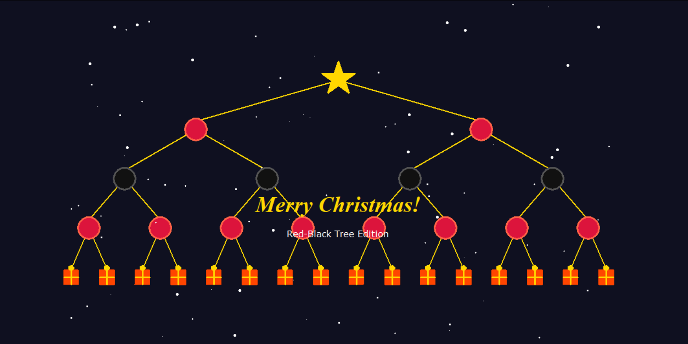

# 🎄 Christmas Red-Black Tree

> **Language Switch: [中文版](./README_zh.md) | [한국어](./README_ko.md)**

An interactive Christmas tree visualization built on a **perfectly balanced Red-Black Tree** structure.

Originally designed with “First Snow” by EXO in mind.

### 🖼️ Preview



### ✨ Features

- **Dynamic Physics**: Animated 4-legged reindeer and falling snow.
- **CS Theme**: Tree nodes follow RBT rules (Black Root -> Red -> Black -> Red).
- **Interactive**: Click the gift nodes to receive randomized CS-themed blessings.

### 🛠️ Customization

#### 1. Change Your Wishes

Open `christmas_rbt.py` and find the `WISH_POOL` list:

```python
WISH_POOL = ["Your Custom Wish 1", "Your Custom Wish 2"]
```

#### 2. Change Music

Replace `music.mp3` in the root folder with your own MP3 file. Keep the filename as `music.mp3`.

### 🚀 Build Executable (.exe)

Install requirements:

```bash
pip install pygame pyinstaller
```

Run:

```bash
pyinstaller --onefile --noconsole christmas_rbt.py
```

Your `.exe` is in the `dist/` folder. Note: Always keep `music.mp3` in the same folder as the `.exe`.